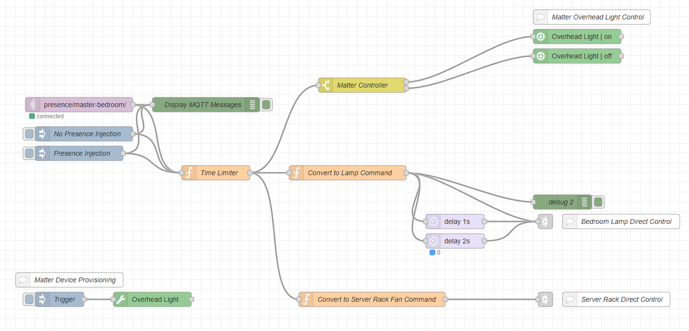

# HC-SR501 Node Red Presence Detector

[](https://github.com/ScottGibb/HC-SR501-Node-Red-Presence-Detector/actions/workflows/megalinter.yaml) [](https://github.com/ScottGibb/HC-SR501-Node-Red-Presence-Detector/actions/workflows/continuous-build.yaml)


## Summary

This is a simple project in which a HC-SR501 PIR sensor is used to detect motion in a room. MQTT is used as the message broker between Home Assistant/Node-Red and Rust running on a Raspberry Pi 4. The code detects the presence and then notifies the server on a change in presence using Home Assistant MQTT Discovery conventions. Node Red or Home Assistant can then control lights on and off within a time frame based on presence and time of day.

## System Architecture

The architecture of the system is shown in the diagram below:


The Key parts are outlined below:

- **Rust Presence Detector**: Is a simple Script that uses polling to detect when the PIR Sensor is triggered. The PIR Sensor is configured for Repeatable Trigger Mode at. The code is constantly checking the pin every 5 seconds or so (This can be configured). At which point it sends an MQTT message on a state change using Home Assistant MQTT Discovery conventions.

- **MQTT Broker** Receives this message before forwarding it on to Home Assistant and/or Node-Red as they are subscribed to the Home Assistant discovery topics.

- **Home Assistant/Node-Red** Will receive the presence state and can then decide what to do. Based on the time of day, the lights may come on or off depending on the state.

## Node Red Control FLow

On the NodeRed side the following [flow](./examples/node-red/timer_flow.json) is used:



This flow will turn the lights in the master bedroom on and off dependent on the presence and the time of day.

### Alexa Integration Issues

Sadly the [Alexa plugin for Node-red](https://flows.nodered.org/node/node-red-contrib-alexa-remote2-applestrudel) by applesstrudel is not working as expected. It seems to be a common issue with the plugin. I sadly had to abandon hopes of controlling my plusminus lightbulb and moved on to using a Matter controlled light bulb.

### Matter Integration

I have since moved to using a matter controlled light bulb. This is a much better solution as it is more reliable and does not require the use of a plugin. The light bulb is controlled using the [Matter](https://flows.nodered.org/node/@sammachin/node-red-matter-controller) plugin.

## Home Assistant Integration

The presence detector now uses Home Assistant MQTT Discovery conventions, making it automatically discoverable by Home Assistant. The sensor publishes to the following topics:

- **Discovery Topic**: `homeassistant/binary_sensor/{device_id}/config` - Contains the sensor configuration for auto-discovery
- **State Topic**: `homeassistant/binary_sensor/{device_id}/state` - Publishes `ON` when presence is detected, `OFF` when no presence
- **Availability Topic**: `homeassistant/binary_sensor/{device_id}/availability` - Publishes `online` when connected, `offline` when disconnected

The sensor will automatically appear in Home Assistant as a binary sensor with device class `occupancy`. You can then use it in automations to control lights, scenes, or any other Home Assistant entities.

## Getting Started

Hardware wise, you must make sure the HC-SR501 is in Repeatable Trigger Mode and that the delay and sensitivity triggers are set accordingly.

Then configure your docker-compose.yaml file like how its configured in the [example](./examples/docker/docker-compose.yaml).

Then when you are ready run the docker compose command:

```bash
docker compose up
```

## Developer Notes

If you are developing with this project, I like to use the [FT232H Breakout Board](https://www.adafruit.com/product/2264) which provides desktop with GPIO, I2C and SPI connections. This can be done using the following command

```bash
RUST_LOG=info cargo run --features=dev
```

This will used the dev-config found [here](./src/config.rs). You may also need to install the following dependencies for the FTD232H Board if you choose to work with it:

```bash
apt install libftdi1 libftdi1-dev
```

## Developer Flow


I started developing this on my Windows Machine using WSL2 and then slowly started pushing towards Raspberry Pi. Interestingly enough I found i had to share my FTD232H Device with WSL2 using the following commands:

```bash
ubbpid list 
PS C:\WINDOWS\system32> usbipd list
Connected:
BUSID  VID:PID    DEVICE                                                        STATE
2-5    1bcf:2a02  Integrated Webcam                                             Not shared
2-6    0403:6014  USB Serial Converter                                          Attached
2-14   8087:0026  Intel(R) Wireless Bluetooth(R)                                Not shared

Persisted:
GUID                                  DEVICE

# Share with WSL2
usbipd bind --busid 2-6
usbipd attach --wsl --busid 2-6
```

Which then in Linux(WSL2) looks like so:

```bash
root@scott-Dev:/mnt/c/Users/scott-dev/OneDrive/Documents/Projects/HC-SR501-Node-Red-Presence-Detector# lsusb
Bus 001 Device 001: ID 1d6b:0002 Linux Foundation 2.0 root hub
Bus 001 Device 002: ID 0403:6014 Future Technology Devices International, Ltd FT232H Single HS USB-UART/FIFO IC
Bus 002 Device 001: ID 1d6b:0003 Linux Foundation 3.0 root hub
```

## Extra Examples

When developing this code I wrote some simple MQTT code which could send and receive from the broker using Home Assistant conventions. It can be ran like the following:

```bash
cargo run --example mock_transmitter  # Sends ON state and publishes discovery config
cargo run --example receiver          # Subscribes to Home Assistant state topic
```

These examples demonstrate the Home Assistant MQTT Discovery pattern and can be useful for testing your MQTT broker and Home Assistant integration.
```

## Useful Links

- [HC-SR501](https://dronebotworkshop.com/using-pir-sensors-with-arduino-raspberry-pi/)
- [Node-Red](https://cookbook.nodered.org/mqtt/connect-to-broker)
- [Matter Controller](https://flows.nodered.org/node/@sammachin/node-red-matter-controller)
- [Alexa Remote](https://flows.nodered.org/node/node-red-contrib-alexa-remote2-applestrudel)
- [WSL2 Sharing USB Devices](https://learn.microsoft.com/en-us/windows/wsl/connect-usb)
